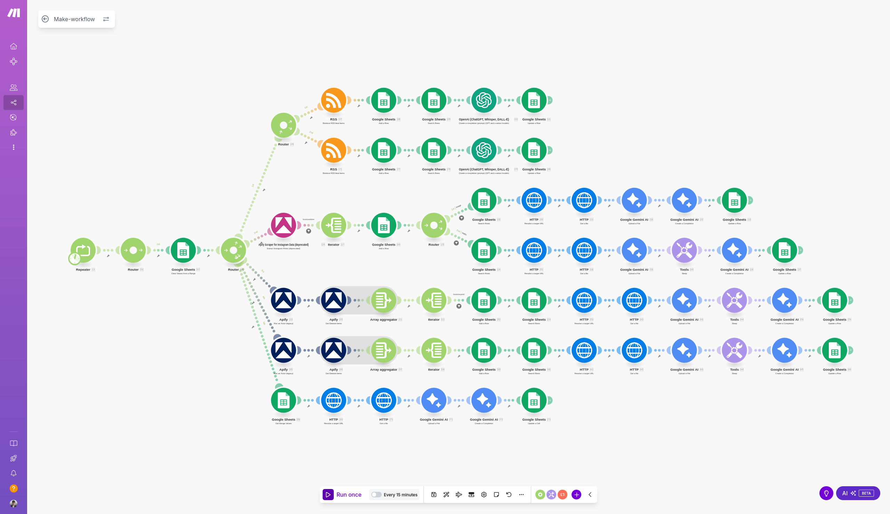
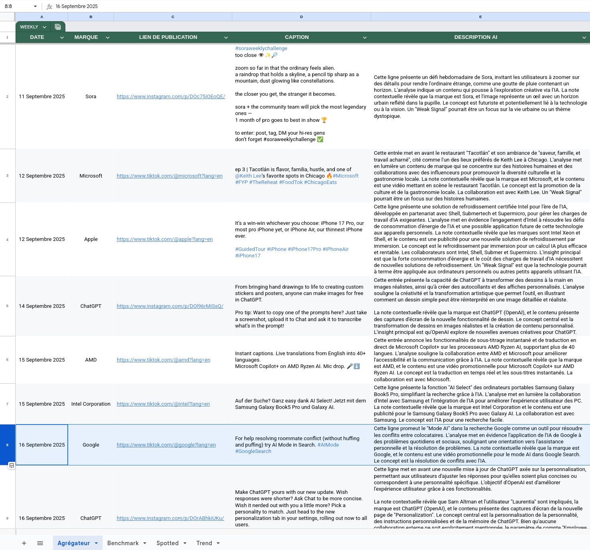

### Make — Workflow d’agrégation « AI Monthly »

Ce workflow Make agrège des contenus publiés sur une niche et une période donnée à partir de plusieurs sources (RSS, Instagram, TikTok) et les écrit dans un Google Sheet cible.

### Prérequis
- **Compte Make** avec accès aux modules requis (RSS, Google Sheets, et éventuellement connecteurs/HTTP pour Instagram/TikTok selon votre implémentation).
- **Connexion Google** configurée dans Make (OAuth) avec accès en écriture au Google Sheet cible.
- **Google Sheet cible** existant avec un onglet, par défaut `Agrégateur`.

### Importer le blueprint
- Fichier: `make-workflow.json` (dans ce dossier).
- Dans Make: Workspace → Scénarios → Importer un blueprint → Sélectionnez `make-workflow.json`.

### Configuration minimale
- **Google Sheets / Clear Range**:
  - `Spreadsheet`: sélectionnez votre fichier.
  - `Sheet`: `Agrégateur` (modifiable).
  - `Range`: `A2:Z400` (adaptez à votre structure).
- **Sources**:
  - RSS: renseignez vos flux (ex: via module RSS « Read Articles »).
  - Instagram / TikTok: selon votre setup, utilisez les modules officiels/HTTP/partenaires et paramétrez les clés nécessaires.
- **Période / Limites**:
  - Ajustez les paramètres (date window, max items) pour éviter les dépassements de quota.

### Schéma fonctionnel
Les premiers modules incluent un `BasicRepeater` et des `BasicRouter` pour orchestrer:
- Nettoyage de la plage dans Google Sheets
- Lecture des sources (RSS/Instagram/TikTok)
- Agrégation et mapping vers le tableau

### Captures d’écran

### Bonnes pratiques & sécurité
- **Ne stockez jamais de secrets en clair** dans des champs texte du scénario. Utilisez les « Connections » Make (Google, HTTP, etc.).
- **Évitez d’exposer des IDs personnels** (drives, chemins) dans la documentation publique.
- **Rate limiting**: prévoyez des temporisations/boucles contrôlées si vous interrogez des APIs tierces.

### Dépannage
- 403/401: vérifiez la connexion Google et les droits sur le Sheet.
- 400 (Range/Sheet): confirmez le nom d’onglet et la plage (ex: `A2:Z400`).
- Données manquantes: testez chaque source séparément pour isoler le maillon fautif.
- 429/limites API: réduisez le nombre d’items/ajoutez des délais.

### Maintenance & versionning
- Conservez une **copie exportée** du blueprint après chaque modification majeure.
- Documentez les changements (date, auteur, modules impactés) pour traçabilité.

### Démarrage rapide
1) Importez `make-workflow.json`.
2) Configurez la connexion Google et sélectionnez votre Sheet.
3) Renseignez vos flux/identifiants sources.
4) Exécutez un run test, validez la structure dans le Sheet.
5) Planifiez l’exécution (scheduler Make) selon vos besoins.
