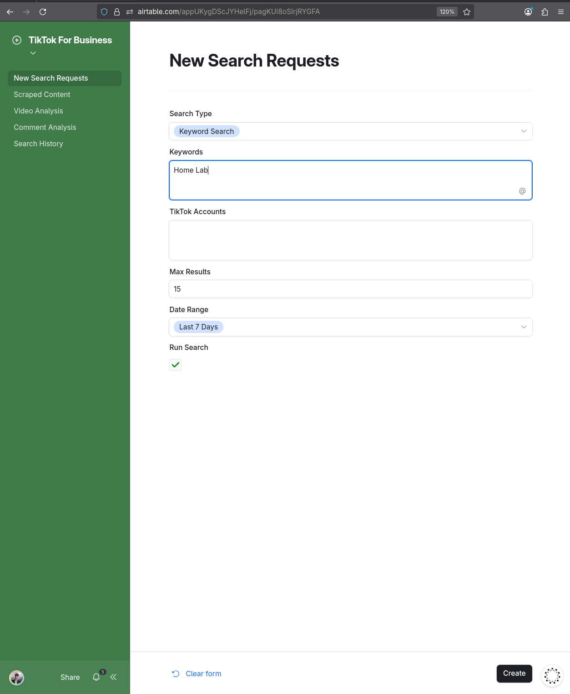
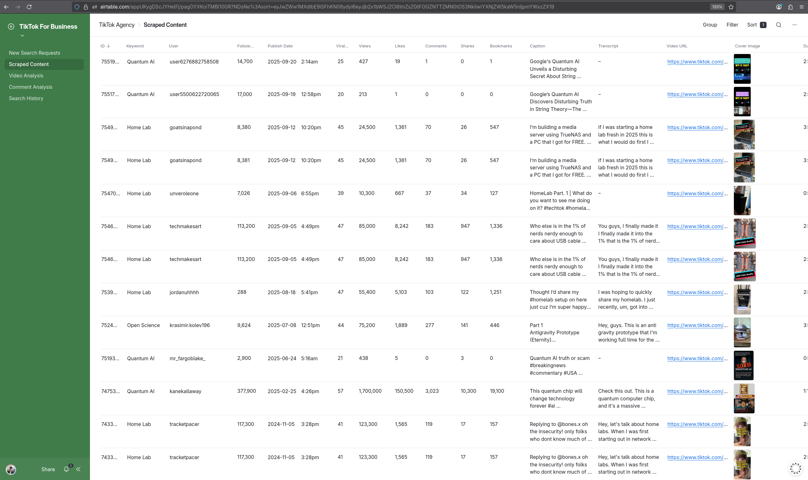

### n8n — Workflow de veille TikTok → Airtable

Ce workflow n8n interroge TikTok via l’acteur Apify, extrait les sous-titres (VTT) pour produire un transcript, et pousse les résultats dans un tableur Airtable (onglet « Scraped Content »). Il expose également un formulaire simplifié pour créer de nouvelles requêtes.

### Prérequis
- **Instance n8n** (cloud ou self-hosted) à jour.
- **Credentials** configurés dans n8n:
  - Apify (token stocké dans des identifiants n8n, pas en clair dans l’URL).
  - Airtable (clé API et Base ID stockés en credentials; ou OAuth selon votre setup).
- **Airtable Base** avec la table/onglet « Scraped Content » (adapter si différent).

### Importer le workflow
- Fichier: `n8n-workflow.json` (dans ce dossier).
- Dans n8n: `Workflows` → `Import from File` → choisissez `n8n-workflow.json`.

### Paramétrage principal
- **Sélecteur de mode**: nœud `Switch` « Keyword vs. Account »
  - « Keyword Search »: requête Apify construite avec `searchQueries`.
  - « Account Search »: requête Apify construite avec `profiles`.
- **Apify**: utilisez un **HTTP Request** avec l’URL de l’acteur `clockworks~tiktok-scraper` et insérez le token via la section `Authentication/Credentials` (évitez `?token=...` en clair).
- **Sous-titres VTT/Transcript**:
  - Nœuds `HTTP Request` (download VTT) + `Code` (extraction transcript). Le code filtre timestamps et en-têtes VTT pour ne garder que le texte.
- **Airtable**: mappez les champs nécessaires (ex: `id`, `author`, `text`, `transcript`, `createTime`, métriques...). Vérifiez la correspondance avec votre table.

### Formulaire de requête
- Le workflow inclut un formulaire pour saisir « Keyword/Account », « Max Results », « Date Range » (`Last 7/30/90 Days`).
- Validez que les champs d’entrée alimentent bien les nœuds HTTP Apify et le switch.

### Captures d’écran

### Bonnes pratiques & sécurité
- **Ne mettez pas le token Apify en clair** dans l’URL. Utilisez les `Credentials` n8n et les `Expressions` pour l’injecter au runtime.
- **Secrets/IDs** (Airtable Base ID, Table ID) doivent être dans des credentials ou variables d’environnement.
- **Rate limiting**: TikTok/Apify peuvent limiter. Ajustez `resultsPerPage`, ajoutez des délais, et gérez les erreurs 429.

### Dépannage
- 401/403: vérifiez les credentials Apify/Airtable et les droits d’accès.
- 400 (schéma): vérifiez le mapping des champs côté Airtable.
- VTT absent: tous les posts n’ont pas de sous-titres; gérer le cas `transcript: null`.
- Aucune donnée: testez séparément les branches « Keywords » et « Profiles »; vérifiez la période (`Last 7/30/90 Days`).

### Maintenance & versionning
- Exportez régulièrement le workflow au format JSON après modifications.
- Notez les changements (date, nœuds affectés, champs Airtable) pour la traçabilité.

### Démarrage rapide
1) Importez `n8n-workflow.json` dans n8n.
2) Créez/configurez les credentials Apify et Airtable.
3) Vérifiez le mapping des champs vers Airtable « Scraped Content ».
4) Testez une recherche par mot-clé avec `resultsPerPage` faible.
5) Activez le workflow et planifiez l’exécution si nécessaire.
